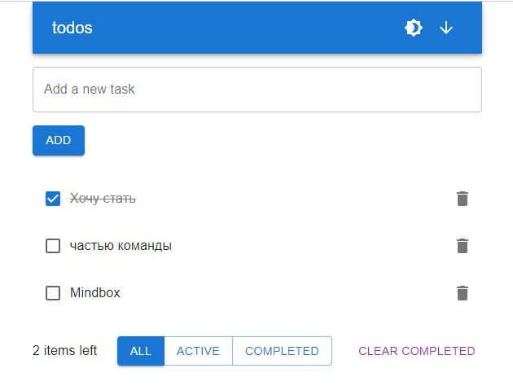

# Mindbox

Тестовое задание Frontend Junior в Mindbox

---

### Stack:

- React
- React Hooks
- TypeScript
- MUI
- Cypress
- Vite

---

### Live Demo: [TODO-APP](https://todo-volkovva.netlify.app/)

---

#### Установить пакеты: `npm install`

#### Запуск проекта: `npm run start`

#### Запуск e2e тестов с графическим отображением: `npm run cypress:open`

#### Запуск e2e тестов в терминале: `npm run cypress:run`

Для запуска Cypress тестов предварительно запустить проект `npm run start`
